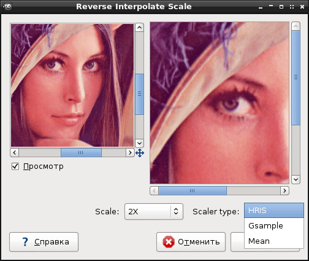

Gimp Reverse Interpolate Scale (RIS) Plugin
===========

GIMP plugin for rescaling images using Reverse Interpolate Scale (RIS)

This plugin is designed to resize images according to the RIS rules, according to which an enlarged image can be returned to the original image by simple averaging.

Supported image scalers:
 * HRIS (hris2x, hris3x)
 * Gsample (gsample2x, gsample3x)
 * Mean (mean/2, mean/3)




Hints:
 * The plugin is located in : Menu -> Filter -> Render -> Reverse Interpolate Scale
 * You can resize the plugin dialog for a larger preview window
 * Currently it only operates on RGB and RGBA images


## Build:

Native compile/install on Linux using below.

```
make (and then copy to your GIMP plugin folder, depends on version)

Plug-in folder locations:
 Linux: ~/.gimp-2.8/plug-ins
 Windows: C:\Program Files\GIMP 2\lib\gimp\2.0\plug-ins

```

Homepage: https://github.com/ImageProcessing-ElectronicPublications/gimp-plugin-ris
